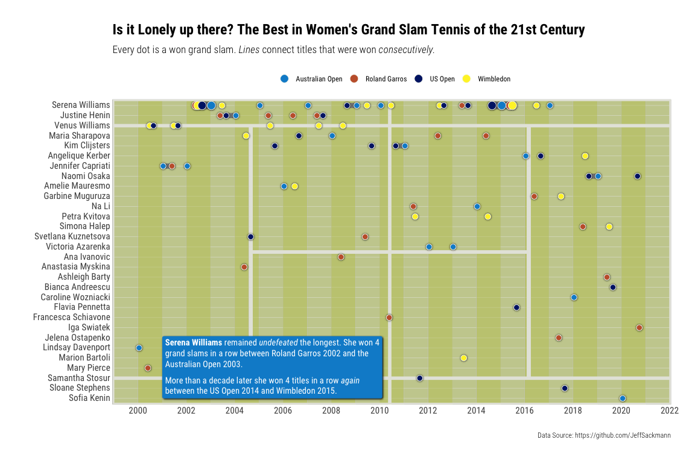

Creating a big tennis viz
================

This is the code to create a visualisation of women’s grand slam winners
in the 21st century, showing who won when, and also if tournaments were
won consecutively.

## Credit where credit is due

### The data

The source data I used was carefully assembled by [Jeff
Sackmann](https://github.com/JeffSackmann) and is freely available on
the internet through the following repositories:

-   <https://github.com/JeffSackmann/tennis_wta>
-   <https://github.com/JeffSackmann/tennis_atp>

For this little project I only focus on women’s data (the wta repo) and
I have already extracted the data that I need and stored it in this
repo.

### The tools

This is a complete [`{tidyverse}` powered
project](https://www.tidyverse.org/). I’ve also used this project as a
way to get to know [Thomas Lin Pedersen’s](https://github.com/thomasp85)
new [`{ggfx}` package](https://github.com/thomasp85/ggfx), which premise
I love as I’m keen to add a bit of *depth* to digital visualisations.

## The code

``` r
library(ggtext)
library(lubridate)
library(tidyverse)
```

## The Data

The original data from <https://github.com/JeffSackmann/tennis_wta> was
filtered to keep only grand slam finals data.

``` r
data_wta <- read_csv("data/wta_grandslam.csv")
```

### Data processing

Here I wrangle the data to identify any streaks, i.e. consecutively won
grand slams. The logic behind this process is explained in a different
repository: <https://github.com/BobbyGlennS/fds-learner-lab>.

``` r
data_wta_cons <- data_wta %>% 
  mutate(date = ymd(tourney_date)) %>% 
  arrange(date) %>% 
  mutate(game_id = row_number()) %>% 
  group_by(winner_name) %>% 
  mutate(
    streak_begin = game_id - lag(game_id, default = -99) != 1,
    streak_id = cumsum(streak_begin)
  ) %>% 
  ungroup()
```

## The visualisation

``` r
min_date <- ymd("2000-01-01")
max_date <- ymd("2020-12-31")

plot_data_subset <- data_wta_cons %>%
  filter(between(date, min_date, max_date)) %>%
  mutate(winner_name = fct_infreq(winner_name) %>% fct_rev())

timeline_data <- plot_data_subset %>%
  group_by(winner_name, streak_id) %>%
  summarise(start_date = min(date),
            end_date = max(date)) %>%
  arrange(start_date)

rect_data <- tibble(
  xmin = seq.Date(from = min_date, to = max_date - 365, by = "2 years"),
  xmax = seq.Date(from = min_date + 365, to = max_date, by = "2 years")
)

serena_hl <- plot_data_subset %>%
  filter(winner_name == "Serena Williams",
         (between(date, ymd("20020101"), ymd("20030401"))) | (between(date, ymd("20140101"), ymd("20160101"))))

serena_hl_tl <- timeline_data %>%
  filter(winner_name == "Serena Williams", (streak_id == 2 | streak_id == 13))

dot_segment_size <- 3

plot_comment <- "**Serena Williams** remained *undefeated* the longest. She won 4  \n grand slams in a row between Roland Garros 2002 and the  \nAustralian Open 2003.  \n\nMore than a decade later she won 4 titles in a row *again*  \nbetween the US Open 2014 and Wimbledon 2015."

p1 <- timeline_data %>%
  ggplot() +
  geom_rect(
    data = rect_data,
    aes(xmin = xmin, xmax = xmax, ymin = -Inf, ymax = Inf),
    fill = "#C0C663",
    alpha = 0.5
  ) +
  geom_rect(
    xmin = ymd("20040901"),
    xmax = ymd("20040901"),
    ymin = "Samantha Stosur",
    ymax = "Venus Williams",
    colour = "#E5E6DE",
    size = 2
  ) +
  geom_rect(
    xmin = ymd("20160301"),
    xmax = ymd("20160301"),
    ymin = "Samantha Stosur",
    ymax = "Venus Williams",
    colour = "#E5E6DE",
    size = 2
  ) +
  geom_rect(
    xmin = ymd("20040901"),
    xmax = ymd("20160301"),
    ymin = 15.5,
    ymax = 15.5,
    colour = "#E5E6DE",
    size = 2
  ) +
  geom_vline(
    xintercept = ymd("20100601"),
    colour = "#E5E6DE",
    size = 2
  ) +
  geom_hline(
    yintercept = "Samantha Stosur",
    colour = "#E5E6DE",
    size = 2
  ) +
  geom_hline(
    yintercept = "Venus Williams",
    colour = "#E5E6DE",
    size = 2
  ) +
  geom_segment(
    aes(x = start_date, xend = end_date, y = winner_name, yend = winner_name),
    colour = "#888888",
    size = dot_segment_size,
    lineend = "round"
  ) +
  geom_segment(
    data = serena_hl_tl,
    aes(x = start_date, xend = end_date, y = winner_name, yend = winner_name),
    colour = "#888888",
    size = dot_segment_size * 1.5,
    lineend = "round"
  ) +
  ggfx::with_shadow(
    geom_point(
      data = plot_data_subset,
      aes(x = date, y = winner_name, fill = tourney_name),
      colour = "#F8F9F1",
      size = dot_segment_size,
      shape = 21
    ),
    colour = "black",
    alpha = 0.2,
    x_offset = 0.1,
    y_offset = 0.1
  ) +
  ggfx::with_shadow(
    geom_point(
      data = serena_hl,
      aes(x = date, y = winner_name, fill = tourney_name),
      colour = "#F8F9F1",
      size = dot_segment_size * 1.5,
      shape = 21
    ),
    colour = "black",
    alpha = 0.2,
    x_offset = 0.2,
    y_offset = 0.2
  ) +
  ggfx::with_shadow(
    annotate(
      "richtext",
      x = ymd("20010101"),
      y = "Sofia Kenin",
      label = plot_comment,
      colour = "white",
      fill = "#058ED1",
      label.size = NA,
      hjust = 0,
      vjust = 0,
      family = "Roboto Condensed"
    ),
    colour = "black",
    x_offset = 1,
    y_offset = 1,
    alpha = 0.4
  ) +
  scale_fill_manual(values = c("#058ED1", "#C56138", "#002074", "#FEF230")) +
  scale_x_date(
    date_breaks = "2 years",
    date_labels = "%Y",
    limits = c(min_date, max_date)
  ) +
  hrbrthemes::theme_ipsum_rc() +
  theme(
    legend.position = "top",
    plot.subtitle = element_markdown(),
    axis.text.y = element_markdown(),
    panel.background = element_rect(fill = "#C9CE9D"),
    panel.border = element_rect(colour = "#E5E6DE", fill=NA, size=2),
    panel.grid.major.y = element_line(colour = "#E5E6DE")
  ) +
  labs(title = "Is it Lonely up there? The Best in Women's Grand Slam Tennis of the 21st Century",
       subtitle = "Every dot is a won grand slam. *Lines* connect titles that were won *consecutively.*",
       x = "",
       y = "",
       colour = "",
       fill = "",
       caption = "Data Source: https://github.com/JeffSackmann"
  )

ggsave("tennis_court.png", p1, width = 12, height = 8)
p1
```

<!-- -->
